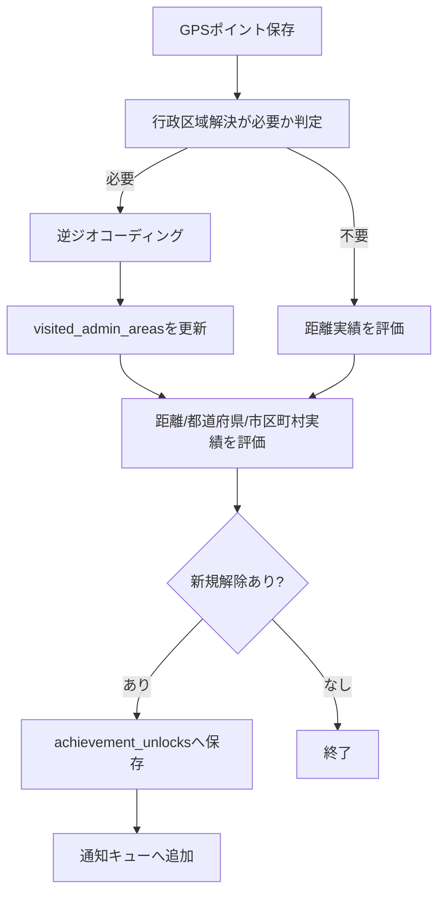

# 実績システム仕様

## 1. 目的

Strollia の継続利用を促すため、GPSログから算出できる行動実績をユーザーへ付与する。

実績は、ユーザーが達成条件を満たしたときに解除されるトロフィーである。トロフィーは画像アセットとしてアプリ内に同梱し、獲得済み実績は実績画面で一覧表示する。

初期対象は以下とする。

- 総移動距離
- ログ記録日数
- 都道府県の訪問数
- 市区町村の訪問数

## 2. 基本方針

実績判定はローカルDB内の記録データから行う。

サーバーは用意しない。GPSログ、訪問エリア、実績解除状態は端末内SQLiteに保存する。

あとから新しい実績を追加した場合でも、保存済みの進捗データから条件を満たしていれば実績を解除できるようにする。そのため、実績判定は「新規GPS保存時の差分判定」と「実績定義追加後やアプリ起動時の再評価」の両方に対応する。

ただし、都道府県・市区町村の訪問実績は、行政区域記録機能の追加後に保存されたログから開始する。現状の既存GPSログには都道府県・市区町村を保存していないため、過去GPSログを一括逆ジオコーディングして補完することは初期実装では行わない。総移動距離実績のみ、既存の `daily_logs.distance_meters` を含めて過去分を再評価する。

## 3. 実績定義

実績定義はコード側に型付き定数として持つ。

実績定義は以下の情報を持つ。

| 項目          | 説明                                                     |
| ------------- | -------------------------------------------------------- |
| `id`          | 実績を一意に識別する固定ID                               |
| `title`       | 実績名                                                   |
| `description` | 達成条件の説明                                           |
| `category`    | `distance`, `logDays`, `prefecture`, `municipality` など |
| `condition`   | 達成条件                                                 |
| `trophyImage` | トロフィー画像アセット参照                               |
| `shareText`   | X共有時の初期文言                                        |
| `sortOrder`   | 実績画面の表示順                                         |
| `enabled`     | 将来の無効化・段階公開用フラグ                           |

初期実績例は以下とする。具体的な閾値とトロフィー画像は実装前に確定する。

| カテゴリ       | 例                                                                                      |
| -------------- | --------------------------------------------------------------------------------------- |
| 総移動距離     | `assets/achievements/odo/` の `odo-{距離}.png` と `odo-earth-{距離}.png` に対応する距離 |
| ログ記録日数   | `assets/achievements/log-days/` のファイル名に対応する記録日数                          |
| 都道府県訪問数 | `assets/achievements/prefectures/` のファイル名に対応する訪問数                         |
| 市区町村訪問数 | `assets/achievements/cities/` のファイル名に対応する訪問数                              |

## 4. 訪問エリア記録

GPSポイントと日別ログに加えて、行政区域の訪問状態とGPSポイント単位の行政区域履歴を保存する。

実績判定には `visited_admin_areas` を使い、月次レポートなどの期間集計には `location_point_admin_areas` を使う。

### 4.1 行政区域の解決方法

初期実装では、Expo / OSの逆ジオコーディングを第一候補にする。

- `expo-location` の `reverseGeocodeAsync` で緯度経度から行政区域を取得する
- 取得できた `region` を都道府県、`city` / `district` / `subregion` などを市区町村候補として正規化する
- 逆ジオコーディングに失敗した点は訪問エリア判定をスキップし、GPSログ自体は保存する

ただし、OS逆ジオコーディングは表記揺れが起きうる。そのため、将来的に正確な行政区域判定が必要になった場合は、日本の行政区域マスタをアプリ内に持つか、境界データによるローカル判定に切り替える余地を残す。

### 4.2 訪問判定の粒度

GPSログのすべての点に対して逆ジオコーディングすると重く、OS API制限にも触れやすい。

初期実装では以下のように間引く。

- 前回行政区域を解決した点から一定距離以上移動した場合のみ解決する
- 同一市区町村内と推定できる短距離移動では再解決しない
- バックグラウンドタスク内で重い処理を詰め込まず、保存後に非同期で評価する

## 5. DBスキーマ案

### 5.1 `visited_admin_areas`

ユーザーが訪問した行政区域を保存する。

| カラム                    | 型           | 説明                                                 |
| ------------------------- | ------------ | ---------------------------------------------------- |
| `id`                      | INTEGER      | 主キー                                               |
| `area_type`               | TEXT         | `prefecture` または `municipality`                   |
| `area_code`               | TEXT NULL    | JIS X 0401 / 0402 等の行政区域コード。初期はNULL許容 |
| `prefecture_name`         | TEXT         | 都道府県名                                           |
| `municipality_name`       | TEXT NULL    | 市区町村名。都道府県レコードではNULL                 |
| `normalized_name`         | TEXT         | 重複判定用の正規化名                                 |
| `first_visited_at`        | TEXT         | 初回訪問時刻                                         |
| `last_visited_at`         | TEXT         | 最終訪問時刻                                         |
| `first_location_point_id` | INTEGER NULL | 初回訪問の根拠GPSポイントID                          |
| `created_at`              | TEXT         | 作成日時                                             |
| `updated_at`              | TEXT         | 更新日時                                             |

重複防止のため、以下のユニーク制約を設ける。

- `area_type, normalized_name`

将来的に行政区域コードが安定取得できる場合は、`area_type, area_code` を優先する。

### 5.2 `location_point_admin_areas`

GPSポイントごとの都道府県・市区町村を保存する。月次レポートなどで対象期間内の都道府県別・市区町村別GPSポイント数を集計するために使う。

| カラム                         | 型        | 説明                      |
| ------------------------------ | --------- | ------------------------- |
| `id`                           | INTEGER   | 主キー                    |
| `location_point_id`            | INTEGER   | 根拠GPSポイントID         |
| `recorded_at`                  | TEXT      | GPSポイントの記録時刻     |
| `local_date`                   | TEXT      | GPSポイントのローカル日付 |
| `prefecture_name`              | TEXT      | 都道府県名                |
| `municipality_name`            | TEXT NULL | 市区町村名                |
| `normalized_prefecture_name`   | TEXT      | 都道府県の正規化名        |
| `normalized_municipality_name` | TEXT NULL | 市区町村の正規化名        |
| `created_at`                   | TEXT      | 作成日時                  |

### 5.3 `achievement_unlocks`

解除済み実績を保存する。

| カラム           | 型        | 説明               |
| ---------------- | --------- | ------------------ |
| `achievement_id` | TEXT      | 実績定義ID。主キー |
| `unlocked_at`    | TEXT      | 解除日時           |
| `progress_value` | REAL NULL | 解除時点の進捗値   |
| `created_at`     | TEXT      | 作成日時           |

同じ実績は一度だけ解除する。

### 5.4 `achievement_notification_queue`

実績解除時の通知・演出を安全に処理するためのキュー。

| カラム              | 型        | 説明                 |
| ------------------- | --------- | -------------------- |
| `id`                | INTEGER   | 主キー               |
| `achievement_id`    | TEXT      | 通知対象の実績ID     |
| `queued_at`         | TEXT      | キュー追加日時       |
| `delivered_push_at` | TEXT NULL | ローカル通知送信日時 |
| `shown_in_app_at`   | TEXT NULL | アプリ内演出表示日時 |
| `created_at`        | TEXT      | 作成日時             |

フォアグラウンド中はアプリ内演出を出す。バックグラウンド中はローカル通知で知らせる。状態が曖昧な場合でも、解除済み実績そのものは `achievement_unlocks` を正とする。

## 6. 進捗計算

### 6.1 トロフィー画像と実績ラインナップ

トロフィー画像は `assets/achievements/` 配下に区分ごとのフォルダーを作って配置する。

| 区分           | フォルダー                         | ファイル名ルール                               |
| -------------- | ---------------------------------- | ---------------------------------------------- |
| 総移動距離     | `assets/achievements/odo/`         | `odo-{距離}.png` または `odo-earth-{距離}.png` |
| ログ記録日数   | `assets/achievements/log-days/`    | `{記録日数}.png`                               |
| 都道府県訪問数 | `assets/achievements/prefectures/` | `{訪問数}.png`                                 |
| 市区町村訪問数 | `assets/achievements/cities/`      | `{訪問数}.png`                                 |

現時点のラインナップは、画像ファイル名から実績定義を作成する。あとから画像と実績定義を追加しても、保存済み進捗から再評価して付与できる設計にする。

ログ記録日数の初期ラインナップは以下とする。

```text
1, 7, 31, 365, 730, 1000
```

`1` は初起動または初回ログ記録に相当する実績として扱う。実装時は、GPSログが1日分以上存在する場合に達成済みと判定する。

都道府県訪問数の初期ラインナップは以下とする。

```text
5, 10, 20, 35, 47
```

市区町村訪問数の初期ラインナップは以下とする。

```text
50, 100, 250, 500, 1000
```

総移動距離の初期ラインナップは以下とする。ファイル名の数値はすべてkm単位として扱い、内部判定ではmへ変換する。

```text
odo-100
odo-200
odo-300
odo-500
odo-750
odo-1000
odo-2000
odo-3000
odo-5000
odo-7500
odo-10000
odo-20000
odo-30000
odo-50000
odo-75000
odo-100000
odo-200000
odo-300000
odo-500000
odo-750000
odo-1000000
odo-2000000
odo-3000000
odo-5000000
odo-7500000
odo-9999999
odo-earth-40000
odo-earth-80000
odo-earth-120000
odo-earth-160000
odo-earth-200000
```

`odo-earth-*` は地球一周相当の特別な距離トロフィーとして扱う。`odo-earth-40000` は「地球1周した」、`odo-earth-80000` は「地球2周した」のように、40,000kmごとの周回数を表示名にする。通常の総移動距離実績名は「100km移動した」のように「移動した」で統一する。

### 6.2 総移動距離

総移動距離は `daily_logs.distance_meters` の合計を使用する。

既存データで `distance_meters` がNULLの場合は、GPSポイントからフォールバック計算する。

GPS記録の吸着状態・距離更新整合性を修正しても、既存の`daily_logs.distance_meters`、実績の解除履歴、通知履歴は再計算・変更しない。これにより、すでに解除済みの実績と保存済み集計値の整合を維持し、修正は更新後のライブ観測だけへ適用する。

### 6.3 ログ記録日数

ログ記録日数は `daily_logs` の記録日数で判定する。

```text
記録日数 >= 実績ごとの必要日数
```

ログ記録日数は既存の `daily_logs` から算出できるため、機能追加時点ですでに条件を満たしている場合は起動時再評価で付与する。

### 6.4 都道府県訪問数

都道府県実績は制覇率ではなく、訪問済み都道府県数で判定する。

```text
訪問済み都道府県数 >= 実績ごとの必要訪問数
```

### 6.5 市区町村訪問数

市区町村実績も制覇率ではなく、訪問済み市区町村数で判定する。

```text
訪問済み市区町村数 >= 実績ごとの必要訪問数
```

市区町村総数は合併・改称で変わる可能性があるため、初期実装では制覇率を使わない。将来的に行政区域マスタを導入した場合のみ、制覇率実績を追加候補とする。

## 7. 実績評価フロー

### 7.1 新規GPS保存時



### 7.2 アプリ起動時・実績定義追加時

アプリ起動時、DB初期化後に実績再評価を実行する。

これにより、あとから新しい実績定義を追加した場合でも、保存済みの進捗データで条件を満たしていれば実績を解除できる。

再評価は以下を行う。

- 既存GPSログから総移動距離を計算する
- `daily_logs` からログ記録日数を集計する
- `visited_admin_areas` から訪問済み都道府県数・市区町村数を集計する
- 未解除の実績定義のみ評価する
- 解除条件を満たすものを `achievement_unlocks` に追加する

都道府県・市区町村については、`visited_admin_areas` に保存済みの訪問データだけを再評価対象にする。行政区域記録機能の追加前に存在していたGPSログを、初期実装でバックフィル対象にはしない。

## 8. 通知と演出

### 8.1 通知

実績解除時はローカル通知を送る。

候補モジュールは `expo-notifications` とする。

通知権限は初回起動時に一度だけ要求する。設定画面に実績通知のON/OFFは用意しない。

ユーザーが通知を許可している場合、実績解除時はフォアグラウンド・バックグラウンドを問わず必ずローカル通知を送る。通知には標準通知音を明示し、iPhoneがロック中またはスリープ中にApple Watchへ転送された場合も通常の通知として気づけるようにする。Apple Watchへの転送先判定はiOS/watchOSの標準ルーティングに従うため、アプリ側では個別に送信先を強制しない。通知には可能な範囲で解除した実績のトロフィー画像を添付する。なお、OSが表示する通知の小さいアプリアイコンはiOS/Expoの制約で通知ごとには差し替えられないため、トロフィー画像は通知添付画像として扱う。通知権限がない場合は通知をスキップし、フォアグラウンド中であればアプリ内演出のみ表示する。

### 8.2 フォアグラウンド演出

アプリがフォアグラウンドにある場合、以下を表示する。

- 1秒間、スマホを強めに震えさせる
- 実績解除ダイアログを開くたびに、左右下から四角形の紙吹雪が吹き上がり、重力で下に落ちて画面外へ退場するアニメーションを表示する
- 実績のトロフィー画像を表示する
- ダイアログは奥からポヨヨンと勢いよく登場し、閉じるときは0.5秒でフェード退場する
- `〇〇を達成しました！` のメッセージを表示する
- `ともだちに自慢する` 共有ボタンを表示する
- `閉じる` ボタンを表示する

タプティックは既存の `expo-haptics` を使う。

複数の実績解除ダイアログがキューに積まれている場合は、1件ずつ表示する。ダイアログ表示中はフォアグラウンド側の定期実績評価を停止し、すべてのダイアログが閉じたあとに再開する。これにより、同じ表示中に新しい実績評価が重なって振動や演出が連続発火することを防ぐ。

紙吹雪は、まず軽量な独自アニメーションまたはExpo互換の依存を検討する。ネイティブ依存が強いライブラリは慎重に判断する。

### 8.3 X共有

`ともだちに自慢する` は、共有文言を作ってOS標準共有シートを開く。

初期実装ではOS標準共有シートを開き、ユーザーが共有先を選べるようにする。共有先アプリ上で文言を自由に編集できる場合は、ユーザーに編集を任せる。

共有シートへ渡す共有文言は共通テンプレートから生成する。

```text
すとろりあで{実績名}を達成しました！

今すぐダウンロード
{AppStoreのURL}
#すとろりあ
#Strollia
#おさんぽログ
```

App Store URLは `STROLLIA_APP_STORE_URL` に集約し、公開後に正式URLへ差し替える。

## 9. 実績画面

メニューに「実績」を追加し、実績画面で一覧確認できるようにする。

実績画面では以下を表示する。

- 獲得済みトロフィー画像
- 未獲得トロフィーのロック表示
- 実績名
- 達成条件
- 達成日時
- 現在の進捗

初期表示はカテゴリ別セクションとする。

- 総移動距離
- ログ記録日数
- 都道府県
- 市区町村

## 10. 開発中の再評価

開発版では、実績解除演出と通知の確認をしやすくするため、起動時に実績解除状態と通知キューをリセットしてから再評価できるフラグを用意する。

このフラグが有効な場合、起動時に `achievement_unlocks` と `achievement_notification_queue` を削除し、保存済み進捗から再評価する。これにより、一度解除済みになった実績でも毎起動ごとに通知・紙吹雪・モーダルを確認できる。

フラグは環境変数 `EXPO_PUBLIC_RESET_ACHIEVEMENTS_ON_LAUNCH=true` で有効化する。既定値は本番混入を防ぐため `false` とする。

previewビルドで確認したい場合は、EASのビルド環境変数に `EXPO_PUBLIC_RESET_ACHIEVEMENTS_ON_LAUNCH=true` を設定する。このフラグは `__DEV__` では判定せず、環境変数の値だけをもとに動作する。

## 11. 実装方針

ディレクトリは以下を想定する。

```text
src/features/achievements/
  achievementDefinitions.ts
  achievementEvaluator.ts
  achievementRepository.ts
  adminAreaRepository.ts
  adminAreaResolver.ts
  achievementNotificationService.ts
  __tests__/
```

UIは既存の `src/app/App.tsx` が大きくなりすぎないよう、実績画面・解除モーダル・紙吹雪表示をコンポーネントへ切り出す。

```text
src/app/components/AchievementListScreen.tsx
src/app/components/AchievementUnlockModal.tsx
src/app/components/ConfettiOverlay.tsx
```

## 12. プライバシー

行政区域の訪問履歴はGPSログから導出できる個人情報である。

以下を守る。

- 訪問エリアと実績状態は端末内SQLiteに保存する
- ユーザー操作なしに外部送信しない
- 共有時はユーザーの明示操作を必須にする
- 共有文言には具体的な現在地や詳細なGPS座標を含めない

## 13. 未決定事項

実装前に以下を決める必要がある。

- 行政区域判定をOS逆ジオコーディングから始めるか、最初から行政区域マスタを同梱するか
- 実績ごとの表示名と説明文
- 実績の初期ラインナップを画像ファイル名から自動検証するか、定義ファイルで明示するか
- トロフィー画像の置き場所、命名規則、解像度
- 紙吹雪アニメーションを独自実装にするか、ライブラリを導入するか

## 14. スポットパック完走実績

特定の地点(スポット)の集合を「パック」としてまとめ、パック内の全スポットへ到達したら実績を解除する。
日本三名瀑パック(スポット3件)をパイロットとして実装済みである。

詳細な設計判断は `docs/superpowers/specs/2026-09-23-landmark-spot-achievements-design.md` を参照する。
パックのラインナップ案は `docs/landmark-spot-packs.md` にある。

### 14.1 位置づけ

スポット実績は **Strollia Plus 限定機能** である(`docs/plus-features.md` §2.2)。

Plus が無効な間はスポット到達の検知そのものを行わない。到達記録は解約後も削除せず、
再加入すればそのまま続きから集められる。

### 14.2 マスタデータ

スポットとパックの実体は `data/landmarks/` のJSONに置く。JSON Schema が型の正であり、
`npm run generate:landmarks` で検証しながら `src/features/landmarks/landmarkCatalog.generated.ts` を生成する。

| ファイル                                   | 役割                               |
| ------------------------------------------ | ---------------------------------- |
| `data/landmarks/landmarkSpots.schema.json` | スポットのJSON Schema              |
| `data/landmarks/landmarkPacks.schema.json` | パックのJSON Schema                |
| `data/landmarks/landmarkSpots.json`        | スポット実体(座標・半径・滞在秒)   |
| `data/landmarks/landmarkPacks.json`        | パック定義(名称・説明・トロフィー) |

スポットとパックは多対多で、スポット側が所属パックと表示順を持つ。識別子はUUIDv7で、
到達記録(`landmark_spot_visits.spot_id`)に保存されるため後から変更しない。

生成時に以下を検証し、問題があればビルド前に失敗させる。

- スキーマ違反(座標が日本国内の範囲外、半径が0以下など)
- ID重複、実在しないパックの参照、パック内の `order` 重複
- スポットが1件もないパック(完走不能になる)

### 14.3 到達判定

到達判定はGPS観測ごとに行う。保存済みGPSポイントだけを見ると、立ち止まっている間は
保存フィルタでポイントがほとんど増えず、最も達成させたい状況で滞在時間が進まないためである。

| 条件       | 内容                                                     |
| ---------- | -------------------------------------------------------- |
| 距離       | スポット中心からの距離が `radiusMeters` 以内(境界を含む) |
| 滞在時間   | 半径内で最初に観測した時刻から `dwellSeconds` 以上経過   |
| ノイズ許容 | 半径外の観測が2回連続するまでは滞在時間をリセットしない  |

滞在の途中状態は `location_recording_state` の `landmark_candidate_spot_id` /
`landmark_candidate_entered_at` / `landmark_outside_count` に保存し、アプリ再起動を跨いでも継続する。
到達の確定は `landmark_spot_visits` へ `INSERT OR IGNORE` で記録し、初回の到達日時を上書きしない。

### 14.4 完走実績

パック完走は既存の実績システム(`achievement_unlocks`)へ乗せる。実績IDはパックIDから
`landmark-pack-<パックUUID>` として機械的に導出し、マスタと実績定義が食い違う余地をなくす。

`condition.type` は `landmarkPackCompletion` で、閾値はパックの有効スポット数である。
`retired` なスポットは分母から外す。既に解除済みの実績は分母が減っても取り消さない。

スポット到達時には、パック完走とは別にスポット単位のローカル通知を出す。

### 14.5 画面

- 実績一覧(`/achievements`)の既存グリッドの下に「スポット (Strollia Plus)」セクションをリスト形式で追加する
- パック行はトロフィー画像・パック名・説明・`3/4` の分数とプログレスバーを表示する
- 行をタップするとパック詳細(`/achievements/[packId]`)へ遷移する
- パック詳細の行タップは、到達済みならその日の日別記録詳細へ、未到達なら地図画面でそのスポットを中心表示する
  - 未到達スポットの地図表示では現在地追従をOFFにする(現在地へ引き戻されないようにするため)
- トロフィーは到達率で3状態に切り替える(0〜50%: 白黒+不透明度40% / 50%超〜100%未満: 白黒 / 100%: フルカラー)
- Plus未加入時は表示順の先頭1パックだけを施錠表示し、進捗は出さない。行タップでペイウォールへ遷移する
