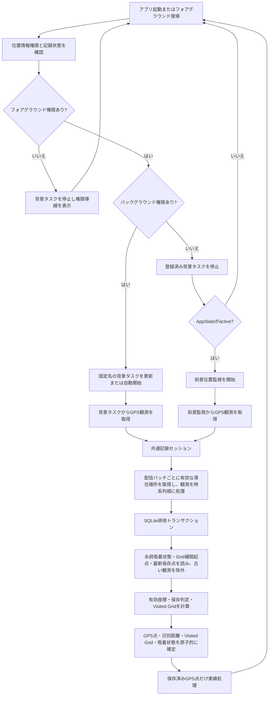
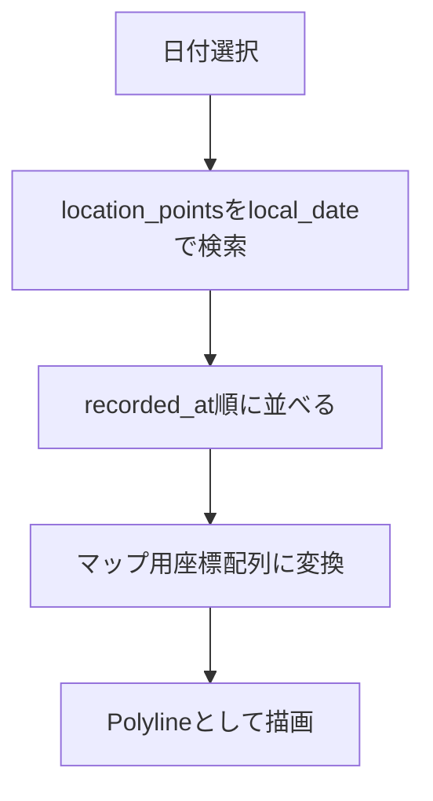
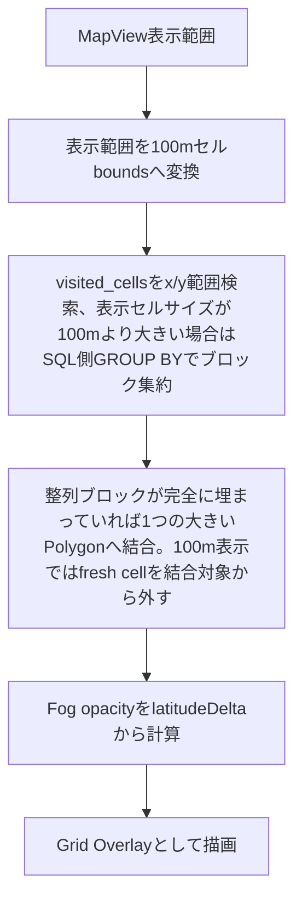

# アーキテクチャ方針

## 1. 基本方針

Strollia は Expo + React Native + TypeScript で実装する。

初期実装では、複雑な状態管理ライブラリやサーバー連携を導入せず、ローカル完結のシンプルな構成にする。

## 2. 技術スタック

| 領域                   | 候補                          | 用途                                                                            |
| ---------------------- | ----------------------------- | ------------------------------------------------------------------------------- |
| アプリ基盤             | Expo                          | React Nativeアプリの開発・ビルド                                                |
| 言語                   | TypeScript                    | 型安全な実装                                                                    |
| 位置情報               | `expo-location`               | GPS取得、フォアグラウンド/バックグラウンド権限リクエスト                        |
| ローカルDB             | `expo-sqlite`                 | GPSログ保存                                                                     |
| マップ                 | `react-native-maps`           | GPSログの地図表示                                                               |
| ファイル               | `expo-file-system`            | GPXファイル作成                                                                 |
| 共有                   | `expo-sharing`                | GPXファイル共有                                                                 |
| バックグラウンドタスク | `expo-task-manager`           | バックグラウンドGPS記録                                                         |
| 画面ON維持             | `expo-keep-awake`             | フォアグラウンド時の画面ロック抑止                                              |
| 写真                   | `expo-media-library`          | 将来の写真ジオタグ表示                                                          |
| ナビゲーション         | `expo-router`                 | ファイルベースルーティング。子スタックで横スライド遷移とiOSスワイプバックを使う |
| OSSライセンス生成      | `license-checker-rseidelsohn` | npm依存のライセンス一覧生成                                                     |

## 3. ディレクトリ構成案

```text
src/
  app/
    App.tsx
  components/
    RecordControls.tsx
    DailyLogList.tsx
    RouteMap.tsx
  features/
    location/
      backgroundLocationTask.ts
      locationService.ts
      locationTrackingConfig.ts
      recordingService.ts
    logs/
      logRepository.ts
      logQueries.ts
    export/
      gpxExporter.ts
    map/
      routeMapper.ts
  db/
    database.ts
    migrations.ts
    schema.ts
  types/
    gps.ts
    logs.ts
  utils/
    date.ts
    distance.ts
```

実際のExpoテンプレートに合わせて調整してよい。

## 4. レイヤー方針

### 4.1 UI層

画面表示とユーザー操作を担当する。

GPS取得、DB操作、GPX生成などの処理は直接書かず、サービスやリポジトリを呼び出す。

### 4.2 サービス層

端末機能やアプリ固有の処理を担当する。

例:

- 位置情報権限の要求
- 現在地取得
- 権限許可後の自動記録開始
- GPX生成

### 4.3 リポジトリ層

SQLiteへの読み書きを担当する。

UI層からSQLを直接実行しない。

### 4.4 DB層

DB接続、マイグレーション、スキーマ定義を担当する。

## 5. GPS記録フロー



## 6. データ取得フロー

### 6.1 メインマップ初期表示範囲

アプリ起動時、`AppStateProvider` は `useLocationRecordingSync` フックを通じて `pointsBounds`(緯度経度の最小値・最大値・ポイント総数)を取得する。この `pointsBounds` は SQLiteの集計クエリ(`getLocationPointsBounds()`)で全ポイントをメモリにロードせず算出される。

その後、`createRegionFromBounds(bounds)` 関数(`src/features/map/routeMapper.ts`)が境界値から初期表示範囲(`initialRegion`)を計算する。この処理は全期間の全ポイント配列に依存しないため、記録年数に関わらず安定して動作する。

### 6.2 日別マップ表示

日別マップ表示では、選択日の `local_date` をもとにSQLiteからGPSポイントを取得する。



### 6.3 全履歴マップ表示

メインマップの全履歴表示では、GPSポイントを直接Polylineへつなぐのではなく、`visited_cells` を表示範囲で取得してGrid Overlayとして描画する。



## 7. 初期実装の判断

初期実装では以下を採用する。

- 起動時とフォアグラウンド復帰時に権限を再取得し、常時許可ならバックグラウンド記録、フォアグラウンド権限のみならactive中の前景記録へ自動で同期する
- 設定画面では通常の開始・停止操作を表示せず、自動開始失敗時だけ復旧用の開始操作を表示する
- データはSQLiteにローカル保存
- メイン画面は全履歴マップを全面表示する
- 日別ログ表示は別画面として扱う
- マップは `react-native-maps`
- エクスポートはまずGPXのみ
- 画面設計はシンプルにし、動く縦切りを優先する

## 8. OSSライセンス表示

設定画面からOSSライセンス画面を開き、アプリで利用しているOSSのライセンスを確認できるようにする。
ライセンス画面は設定画面と同じ戻るボタンのテイストを使い、設定画面へ戻る導線は「設定」と表示する。
一覧はカード型ではなくライブラリ名だけを並べるリスト型UIにし、項目をタップすると通常の画面遷移でライセンス詳細を表示する。
詳細画面は通常の画面遷移として扱い、戻るボタンのラベルを「ライセンス」にしてライブラリ一覧へ戻る。

ライセンス一覧は実行時に `node_modules` やnative projectを探索せず、`npm run generate:licenses` で `src/app/generated/ossLicenses.ts` へ静的生成する。npm依存の収集には `license-checker-rseidelsohn` を使い、ライセンス名、リポジトリ、ライセンス本文、NOTICE本文を保存する。依存関係を追加・更新した場合は、ライセンス一覧も再生成する。

滞在場所の固定アイコンには同梱したTwemoji PNGを使う。Twemoji graphicsのCC-BY 4.0帰属表記は、この同じOSSライセンス画面の静的一覧へ含める。実行時に絵文字CDNへアクセスしない。

Expo managed checkoutでは `ios/` や `android/` が存在しない場合がある。その場合はnpm依存のみを生成対象にする。`ios/Pods/Target Support Files/**/**-acknowledgements.plist` が存在するprebuild/build環境では、CocoaPodsが生成するAcknowledgements plistも読み込み、iOS native依存のライセンスも同じ画面に統合する。

## 9. 子ページ遷移

地図画面と各トップ画面の行き来を除き、アプリ内の子ページ遷移は共通の横スライドにする。
親ページから子ページへ進む場合は右端から子ページが重なるように表示し、戻る場合は上に乗っている子ページを避けるようにして親ページへ戻る。
子ページではiOS風の左端スワイプ戻りをサポートし、スワイプ中の画面は指の動きに追従する。

この挙動は独自のジェスチャ実装ではなく、React Navigationのnative stackを使って実現する。

## 10. 将来の拡張余地

将来的に以下を追加しやすいようにする。

- GPX / KML インポート
- KMLエクスポート
- from-to 範囲指定UI
- 全履歴マップ
- 写真ジオタグ表示
- 独自バックアップ形式

## 11. バックグラウンド記録方針

バックグラウンド記録は `expo-location` の `startLocationUpdatesAsync` と `expo-task-manager` の `defineTask` を使用する。

タスク定義はReactコンポーネント内ではなく、JavaScriptバンドルのトップレベルで読み込まれるモジュールに置く。

自動記録開始時は以下を行う。

- フォアグラウンド位置情報権限を確認する
- バックグラウンド位置情報権限を確認する
- 未開始の場合のみバックグラウンド位置情報タスクを開始する

登録済みタスクへ監視オプションの変更を反映する場合は、現在の登録値と最新値を比較する。差分がある場合だけ同じタスク名で `startLocationUpdatesAsync` を呼び、Expo TaskManagerの既存タスク更新を利用する。記録中タスクを明示的に停止して再登録してはならない。

登録値が最新の場合は `startLocationUpdatesAsync` を呼ばず、位置監視をそのまま継続する。

iOSでは `showsBackgroundLocationIndicator: false` を維持しつつ、Core Locationの継続的なバックグラウンド更新がサスペンドされる組み合わせを避けるため、ネイティブの `distanceInterval` を指定しない。Androidでは5mの距離フィルターを維持する。GPSポイントの保存間隔はプラットフォーム共通の5m保存判定で制御し、iOSで受信回数が増えてもSQLiteへ保存するポイントを無制限に増やさない。

位置情報の保存処理は前景・背景で共通の記録フローを使用する。セッションはGrid補間起点や最新GPS点を保持・取得せず、配信バッファ、時系列ソート、有効滞在場所の取得、Recorderへの委譲、保存後の実績処理だけを担う。吸着の入場・退出状態とVisited Grid補間起点は`location_recording_state`のID=`1`単一行を正とするため、前景・背景・JSプロセス再生成後も共有される。

1観測はSQLite排他トランザクション内で、永続吸着状態とGrid補間起点、保存判定用の最新GPS点を読み、古い観測の除外、吸着判定、有効座標による保存判定、Visited Grid、GPS点挿入、日別距離の差分加算、状態更新までを確定する。GPS点が保存対象外でもVisited Gridと吸着状態を更新し、セルを更新できた有効座標は次のGrid補間起点として保存する。滞在場所取得が一時的に失敗した観測は生座標を使いつつ吸着状態を維持する。トランザクション確定後、保存済みGPS点だけを実績処理へ渡す。バッチ後半の記録に失敗した場合は失敗観測以降だけを再キューし、先に確定した点の実績処理を終えてから元の記録エラーを返す。実績処理の失敗は警告に留め、記録エラーを上書きしない。

権限状態ごとの保存元は以下とする。

| 権限状態                                     | AppState                  | 保存元                          |
| -------------------------------------------- | ------------------------- | ------------------------------- |
| フォアグラウンド・バックグラウンドともに許可 | 全状態                    | 固定名のバックグラウンドタスク  |
| フォアグラウンドのみ許可                     | `active`                  | `watchPositionAsync` の前景購読 |
| フォアグラウンドのみ許可                     | `inactive` / `background` | 保存しない                      |
| フォアグラウンド権限なし                     | 全状態                    | 保存しない                      |

フォアグラウンド限定記録は `AppState === 'active'` の場合だけ購読する。`inactive` または `background` へ移行した場合は購読を解除し、`active` 復帰時に権限と背景タスク状態を再同期してから再開する。最後に取得済みの位置は現在地表示にだけ使い、古い観測として保存しない。

バックグラウンド権限がなくなった場合は、以前に登録したバックグラウンドタスクを停止してから前景限定保存を有効にする。この停止は権限モードを切り替えるための処理であり、監視オプション更新のための `stop→start` ではない。停止に失敗した場合は二重保存を避けるため前景保存を開始しない。

常時許可かつカスタム現在地アイコンの場合は、固定名のバックグラウンドタスク1件が保存を担当し、前景の `watchPositionAsync` 購読1件はアイコン表示だけを担当する。前景購読はTaskManagerのタスク登録ではなく、保存セッションも呼ばないため、タスク重複と二重保存は発生しない。

通常のユーザー導線として記録停止は提供しない。記録を止めたい場合はOS側の位置情報権限変更に従う。

iOS / Android ともにバックグラウンド位置情報にはOS側の制約があるため、10秒間隔は目標値であり、OSによって間引かれる可能性がある。

## 10. テーマ方針

アプリのテーマはOSのカラースキームに追従する。

- OSがライトモードの場合はライトテーマを使う
- OSがダークモードの場合はダークテーマを使う
- ユーザー独自のテーマ切り替え設定は初期仕様では持たない

## 11. 画面ON維持方針

設定画面に「常に画面をONにする」を用意する。

この設定が有効で、かつアプリがフォアグラウンドにある場合のみ、画面ロックを抑止する。バックグラウンドでは抑止しない。

設定説明では、記録の精度が上がる可能性がある一方で、消費電力が増えることを明記する。

## 12. 課金・カスタマイズ方針

見た目のカスタマイズは Strollia Plus として RevenueCat で管理する。

課金状態の取得は UI に直接書かず、`src/features/premium/` の境界を通す。現在地アイコンの候補は `src/features/customization/` にまとめる。アプリアイコン変更は初期の課金対象から外す。

無料状態では、現在地アイコンはOS標準表示を使う。Plus有効時にのみ、現在地アイコンはOS標準表示から独自Markerへ切り替えられる設計とする。メインマップはVisited Grid Overlayを主表示とするため、ルート線の見た目設定は持たない。

GPSログや写真メタデータはRevenueCatへ送信しない。

重大な例外やクラッシュの解析にはSentryを利用する。Sentryのproject slugは `strollia` とする。初期運用ではproductionビルドのみアプリクラッシュや未捕捉例外を自動捕捉し、必要に応じて調査対象として明示した例外も送信する。developmentビルドとpreviewビルドでは無料枠を消費しないよう、Sentry SDKの初期化とRoot Componentのwrapを行わず、EAS profileでは `SENTRY_DISABLE_AUTO_UPLOAD=true` も設定する。Sentryへはスタックトレース、アプリ/ビルド情報、OS/端末情報、画面名、RevenueCatのSupport ID、サブスク加入状況などの診断情報を送るが、GPSログ本体や写真ジオタグ、座標値は送信しない。Sentry SDKのPII送信は無効化し、送信直前にも位置情報らしいフィールドをマスクする。

Sentryへ送信する項目は以下に限定する。

- 未捕捉例外やクラッシュのエラー内容、スタックトレース
- Sentry SDKが付与する実行環境情報、SDK情報、リリース/ソースマップ紐づけに必要な情報
- アプリ情報: Application ID、アプリ名、アプリバージョン、Build番号、Runtime Version
- 端末/OS情報: 動作プラットフォーム（`ios` / `android`）、OS名、iOS/Androidバージョン、端末モデル、端末モデルID、UI種別
- Support ID: RevenueCat App User IDをSentryの `user.id` として設定する
- サブスク加入状況: `free` / `plus`、Plus有効状態、RevenueCat entitlement ID
- 画面名: `Map`、`DailyLogs:DailyLogList`、`DailyLogs:DailyLogDetail`、`AchievementList`、`MonthlyReport`、`Settings:SettingsHome`、`Settings:AboutApp`、`Settings:LicenseList`、`Settings:LicenseDetail`、`PremiumPaywall`、`FirstLaunchTutorial`、`FirstLaunchTutorialReplay`、`PhotoPreview`
- 調査対象として明示送信する例外では、調査領域、画面名、呼び出し元が追加したタグ/コンテキスト

Sentryへ送信しない項目は以下とする。

- GPSログ本体、ルート点列、緯度経度、速度、高度、方角、精度
- 写真画像、写真ジオタグ、写真ライブラリのメタデータ本文
- GPX / KMLファイル本文、インポート/エクスポート対象データ本文
- ユーザーのメールアドレス、氏名などの個人情報

送信前のスクラブ処理で位置情報らしいキーはマスクする。対象キーは `accuracy`、`altitude`、`altitudeAccuracy`、`coordinate`、`coordinates`、`coords`、`heading`、`lat`、`latitude`、`latitudeDelta`、`lng`、`location`、`locations`、`lon`、`longitude`、`longitudeDelta`、`speed` とする。

## 13. 実績システム方針

実績システムは `src/features/achievements/` にまとめる。

GPSログ保存、行政区域解決、実績評価、通知・演出は責務を分ける。実績定義はコード側の型付き定数として管理し、解除済み状態はSQLiteへ保存する。

あとから実績定義を追加した場合でも、保存済みの進捗データから再評価し、すでに条件を満たしている実績を付与できるようにする。総移動距離は既存GPSログを含めて再評価し、ログ記録日数は既存daily_logsを含めて再評価し、都道府県・市区町村は行政区域記録機能の追加後に保存された訪問エリアの訪問数を対象にする。

詳細は `docs/achievements.md` を参照する。
