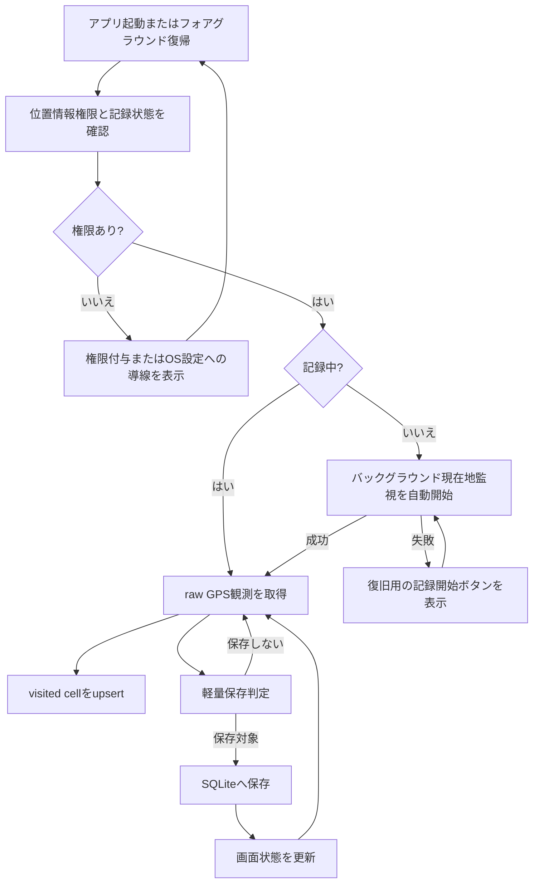
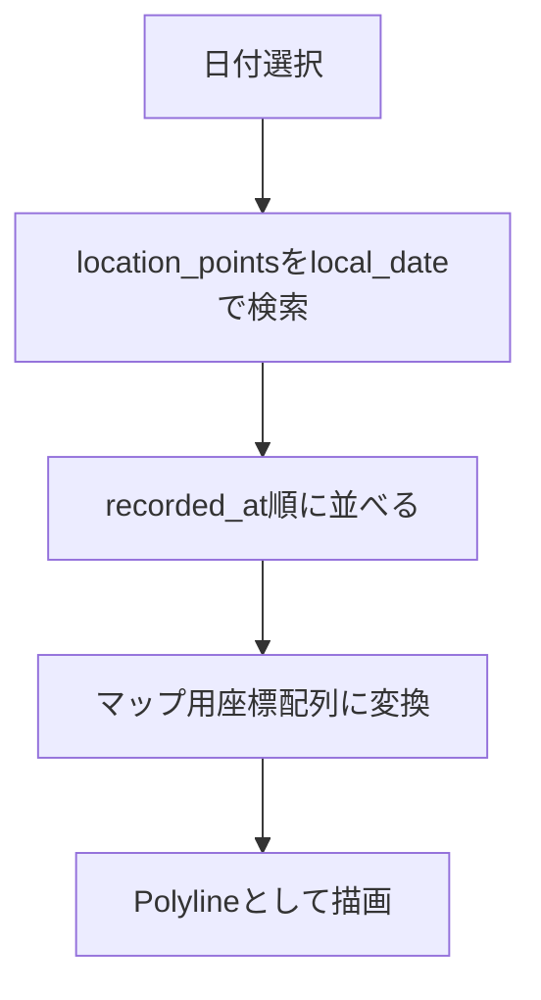
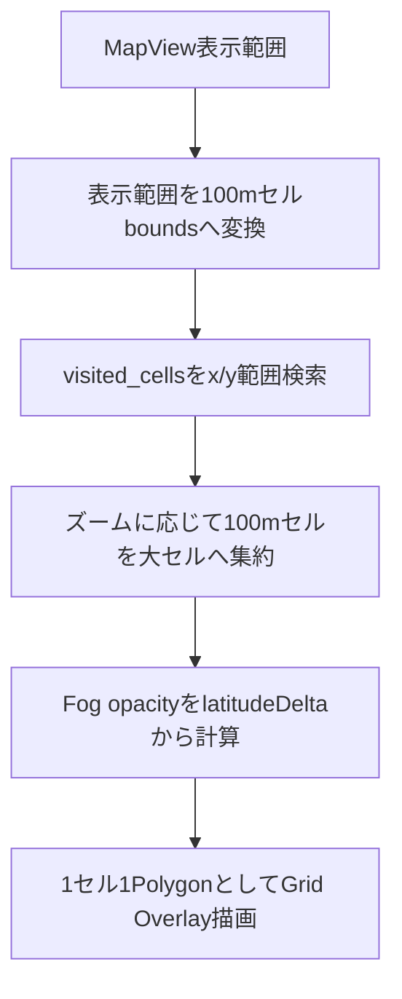

# アーキテクチャ方針

## 1. 基本方針

Strollia は Expo + React Native + TypeScript で実装する。

初期実装では、複雑な状態管理ライブラリやサーバー連携を導入せず、ローカル完結のシンプルな構成にする。

## 2. 技術スタック

| 領域 | 候補 | 用途 |
| --- | --- | --- |
| アプリ基盤 | Expo | React Nativeアプリの開発・ビルド |
| 言語 | TypeScript | 型安全な実装 |
| 位置情報 | `expo-location` | GPS取得、フォアグラウンド/バックグラウンド権限リクエスト |
| ローカルDB | `expo-sqlite` | GPSログ保存 |
| マップ | `react-native-maps` | GPSログの地図表示 |
| ファイル | `expo-file-system` | GPXファイル作成 |
| 共有 | `expo-sharing` | GPXファイル共有 |
| バックグラウンドタスク | `expo-task-manager` | バックグラウンドGPS記録 |
| 画面ON維持 | `expo-keep-awake` | フォアグラウンド時の画面ロック抑止 |
| 写真 | `expo-media-library` | 将来の写真ジオタグ表示 |
| 子ページ遷移 | `@react-navigation/native-stack` | iOS風の横スライド遷移と戻りジェスチャ |
| OSSライセンス生成 | `license-checker-rseidelsohn` | npm依存のライセンス一覧生成 |

## 3. ディレクトリ構成案

```text
src/
  app/
    App.tsx
  components/
    RecordControls.tsx
    DailyLogList.tsx
    RouteMap.tsx
  features/
    location/
      backgroundLocationTask.ts
      locationService.ts
      locationTrackingConfig.ts
      recordingService.ts
    logs/
      logRepository.ts
      logQueries.ts
    export/
      gpxExporter.ts
    map/
      routeMapper.ts
  db/
    database.ts
    migrations.ts
    schema.ts
  types/
    gps.ts
    logs.ts
  utils/
    date.ts
    distance.ts
```

実際のExpoテンプレートに合わせて調整してよい。

## 4. レイヤー方針

### 4.1 UI層

画面表示とユーザー操作を担当する。

GPS取得、DB操作、GPX生成などの処理は直接書かず、サービスやリポジトリを呼び出す。

### 4.2 サービス層

端末機能やアプリ固有の処理を担当する。

例:

- 位置情報権限の要求
- 現在地取得
- 権限許可後の自動記録開始
- GPX生成

### 4.3 リポジトリ層

SQLiteへの読み書きを担当する。

UI層からSQLを直接実行しない。

### 4.4 DB層

DB接続、マイグレーション、スキーマ定義を担当する。

## 5. GPS記録フロー



## 6. データ取得フロー

日別マップ表示では、選択日の `local_date` をもとにSQLiteからGPSポイントを取得する。



メインマップの全履歴表示では、GPSポイントを直接Polylineへつなぐのではなく、`visited_cells` を表示範囲で取得してGrid Overlayとして描画する。



## 7. 初期実装の判断

初期実装では以下を採用する。

- 起動時とフォアグラウンド復帰時に、権限が揃っていればバックグラウンド記録開始を自動で試みる
- 設定画面では通常の開始・停止操作を表示せず、自動開始失敗時だけ復旧用の開始操作を表示する
- データはSQLiteにローカル保存
- メイン画面は全履歴マップを全面表示する
- 日別ログ表示は別画面として扱う
- マップは `react-native-maps`
- エクスポートはまずGPXのみ
- 画面設計はシンプルにし、動く縦切りを優先する

## 8. OSSライセンス表示

設定画面からOSSライセンス画面を開き、アプリで利用しているOSSのライセンスを確認できるようにする。
ライセンス画面は設定画面と同じ戻るボタンのテイストを使い、設定画面へ戻る導線は「設定」と表示する。
一覧はカード型ではなくライブラリ名だけを並べるリスト型UIにし、項目をタップすると通常の画面遷移でライセンス詳細を表示する。
詳細画面は通常の画面遷移として扱い、戻るボタンのラベルを「ライセンス」にしてライブラリ一覧へ戻る。

ライセンス一覧は実行時に `node_modules` やnative projectを探索せず、`npm run generate:licenses` で `src/app/generated/ossLicenses.ts` へ静的生成する。npm依存の収集には `license-checker-rseidelsohn` を使い、ライセンス名、リポジトリ、ライセンス本文、NOTICE本文を保存する。依存関係を追加・更新した場合は、ライセンス一覧も再生成する。

Expo managed checkoutでは `ios/` や `android/` が存在しない場合がある。その場合はnpm依存のみを生成対象にする。`ios/Pods/Target Support Files/**/**-acknowledgements.plist` が存在するprebuild/build環境では、CocoaPodsが生成するAcknowledgements plistも読み込み、iOS native依存のライセンスも同じ画面に統合する。

## 9. 子ページ遷移

地図画面と各トップ画面の行き来を除き、アプリ内の子ページ遷移は共通の横スライドにする。
親ページから子ページへ進む場合は右端から子ページが重なるように表示し、戻る場合は上に乗っている子ページを避けるようにして親ページへ戻る。
子ページではiOS風の左端スワイプ戻りをサポートし、スワイプ中の画面は指の動きに追従する。

この挙動は独自のジェスチャ実装ではなく、React Navigationのnative stackを使って実現する。

## 10. 将来の拡張余地

将来的に以下を追加しやすいようにする。

- GPX / KML インポート
- KMLエクスポート
- from-to 範囲指定UI
- 全履歴マップ
- 写真ジオタグ表示
- 独自バックアップ形式

## 11. バックグラウンド記録方針

バックグラウンド記録は `expo-location` の `startLocationUpdatesAsync` と `expo-task-manager` の `defineTask` を使用する。

タスク定義はReactコンポーネント内ではなく、JavaScriptバンドルのトップレベルで読み込まれるモジュールに置く。

自動記録開始時は以下を行う。

- フォアグラウンド位置情報権限を確認する
- バックグラウンド位置情報権限を確認する
- 未開始の場合のみバックグラウンド位置情報タスクを開始する

通常のユーザー導線として記録停止は提供しない。記録を止めたい場合はOS側の位置情報権限変更に従う。

iOS / Android ともにバックグラウンド位置情報にはOS側の制約があるため、10秒間隔は目標値であり、OSによって間引かれる可能性がある。

## 10. テーマ方針

アプリのテーマはOSのカラースキームに追従する。

- OSがライトモードの場合はライトテーマを使う
- OSがダークモードの場合はダークテーマを使う
- ユーザー独自のテーマ切り替え設定は初期仕様では持たない

## 11. 画面ON維持方針

設定画面に「常に画面をONにする」を用意する。

この設定が有効で、かつアプリがフォアグラウンドにある場合のみ、画面ロックを抑止する。バックグラウンドでは抑止しない。

設定説明では、記録の精度が上がる可能性がある一方で、消費電力が増えることを明記する。


## 12. 課金・カスタマイズ方針

見た目のカスタマイズは Strollia Plus として RevenueCat で管理する。

課金状態の取得は UI に直接書かず、`src/features/premium/` の境界を通す。現在地アイコンの候補は `src/features/customization/` にまとめる。アプリアイコン変更は初期の課金対象から外す。

無料状態では、現在地アイコンはOS標準表示を使う。Plus有効時にのみ、現在地アイコンはOS標準表示から独自Markerへ切り替えられる設計とする。メインマップはVisited Grid Overlayを主表示とするため、ルート線の見た目設定は持たない。

GPSログや写真メタデータはRevenueCatへ送信しない。

重大な例外やクラッシュの解析にはSentryを利用する。無料枠を守るため、自動捕捉されたイベントは送信直前に破棄し、調査対象として明示した例外だけをSentryへ送る。Sentryへはスタックトレースや実行環境の診断情報を送るが、GPSログ本体や写真ジオタグ、座標値は送信しない。Sentry SDKのPII送信は無効化し、送信直前にも位置情報らしいフィールドをマスクする。

## 13. 実績システム方針

実績システムは `src/features/achievements/` にまとめる。

GPSログ保存、行政区域解決、実績評価、通知・演出は責務を分ける。実績定義はコード側の型付き定数として管理し、解除済み状態はSQLiteへ保存する。

あとから実績定義を追加した場合でも、保存済みの進捗データから再評価し、すでに条件を満たしている実績を付与できるようにする。総移動距離は既存GPSログを含めて再評価し、ログ記録日数は既存daily_logsを含めて再評価し、都道府県・市区町村は行政区域記録機能の追加後に保存された訪問エリアの訪問数を対象にする。

詳細は `docs/achievements.md` を参照する。
