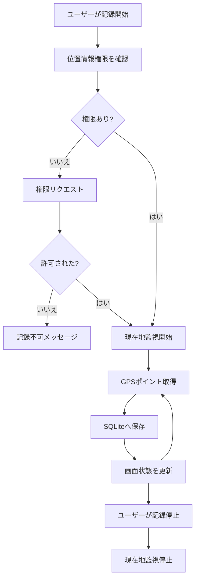
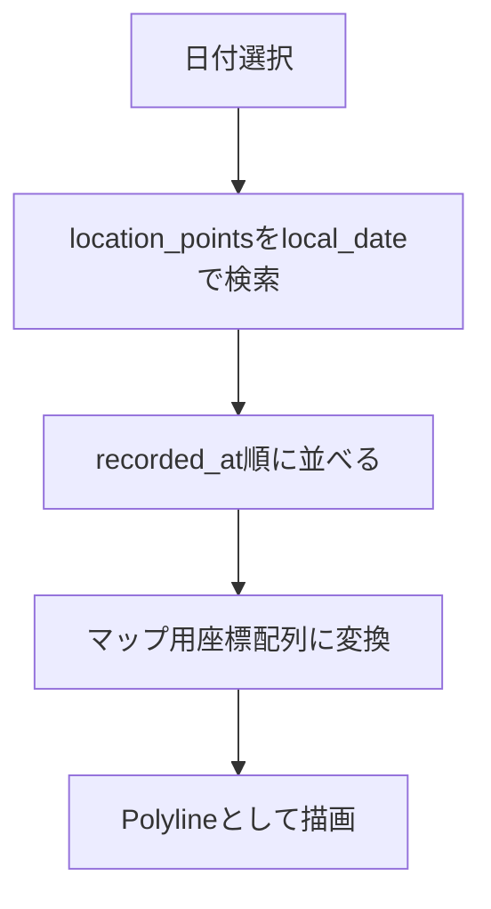

# アーキテクチャ方針

## 1. 基本方針

Strollia は Expo + React Native + TypeScript で実装する。

初期実装では、複雑な状態管理ライブラリやサーバー連携を導入せず、ローカル完結のシンプルな構成にする。

## 2. 技術スタック

| 領域 | 候補 | 用途 |
| --- | --- | --- |
| アプリ基盤 | Expo | React Nativeアプリの開発・ビルド |
| 言語 | TypeScript | 型安全な実装 |
| 位置情報 | `expo-location` | GPS取得、フォアグラウンド/バックグラウンド権限リクエスト |
| ローカルDB | `expo-sqlite` | GPSログ保存 |
| マップ | `react-native-maps` | GPSログの地図表示 |
| ファイル | `expo-file-system` | GPXファイル作成 |
| 共有 | `expo-sharing` | GPXファイル共有 |
| バックグラウンドタスク | `expo-task-manager` | バックグラウンドGPS記録 |
| 写真 | `expo-media-library` | 将来の写真ジオタグ表示 |

## 3. ディレクトリ構成案

```text
src/
  app/
    App.tsx
  components/
    RecordControls.tsx
    DailyLogList.tsx
    RouteMap.tsx
  features/
    location/
      backgroundLocationTask.ts
      locationService.ts
      locationTrackingConfig.ts
      recordingService.ts
    logs/
      logRepository.ts
      logQueries.ts
    export/
      gpxExporter.ts
    map/
      routeMapper.ts
  db/
    database.ts
    migrations.ts
    schema.ts
  types/
    gps.ts
    logs.ts
  utils/
    date.ts
    distance.ts
```

実際のExpoテンプレートに合わせて調整してよい。

## 4. レイヤー方針

### 4.1 UI層

画面表示とユーザー操作を担当する。

GPS取得、DB操作、GPX生成などの処理は直接書かず、サービスやリポジトリを呼び出す。

### 4.2 サービス層

端末機能やアプリ固有の処理を担当する。

例:

- 位置情報権限の要求
- 現在地取得
- 記録開始・停止
- GPX生成

### 4.3 リポジトリ層

SQLiteへの読み書きを担当する。

UI層からSQLを直接実行しない。

### 4.4 DB層

DB接続、マイグレーション、スキーマ定義を担当する。

## 5. GPS記録フロー



## 6. データ取得フロー

日別マップ表示では、選択日の `local_date` をもとにSQLiteからGPSポイントを取得する。



## 7. 初期実装の判断

初期実装では以下を採用する。

- 起動時に自動でバックグラウンド記録開始を試みる
- 記録開始・停止は設定画面から手動操作できる
- データはSQLiteにローカル保存
- メイン画面は全履歴マップを全面表示する
- 日別ログ表示は別画面として扱う
- マップは `react-native-maps`
- エクスポートはまずGPXのみ
- 画面設計はシンプルにし、動く縦切りを優先する

## 8. 将来の拡張余地

将来的に以下を追加しやすいようにする。

- GPX / KML インポート
- KMLエクスポート
- from-to 範囲指定UI
- 全履歴マップ
- 写真ジオタグ表示
- 独自バックアップ形式

## 9. バックグラウンド記録方針

バックグラウンド記録は `expo-location` の `startLocationUpdatesAsync` と `expo-task-manager` の `defineTask` を使用する。

タスク定義はReactコンポーネント内ではなく、JavaScriptバンドルのトップレベルで読み込まれるモジュールに置く。

記録開始時は以下を行う。

- フォアグラウンド位置情報権限を確認する
- バックグラウンド位置情報権限を確認する
- 未開始の場合のみバックグラウンド位置情報タスクを開始する

記録停止時はバックグラウンド位置情報タスクを停止する。

iOS / Android ともにバックグラウンド位置情報にはOS側の制約があるため、10秒間隔は目標値であり、OSによって間引かれる可能性がある。
