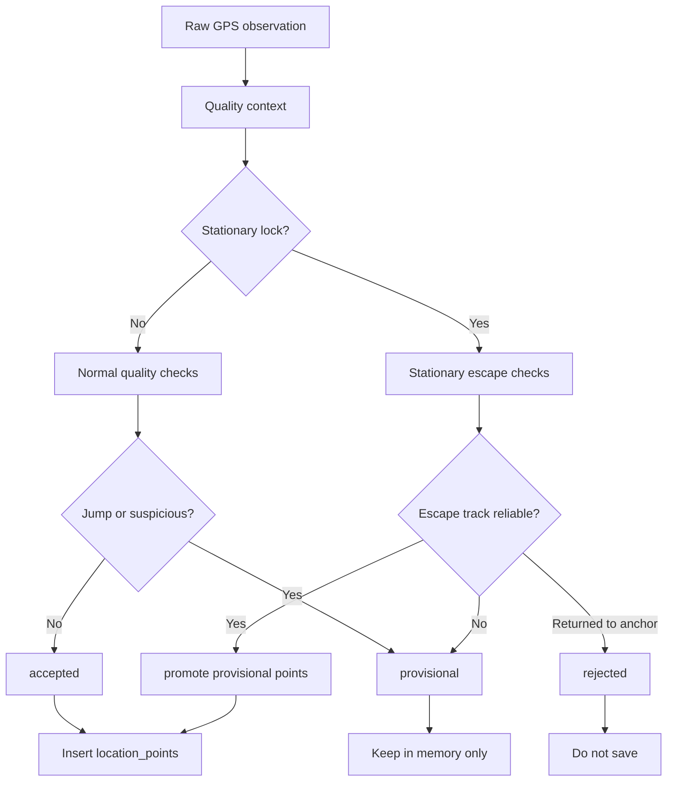

# GPS Stationary Drift Quality Design

## 背景

PR #9 で GPS 観測を `accepted` / `provisional` / `rejected` に分け、明らかな飛び点、短い誤軌道、停止中ドリフトを保存前に抑える基盤を追加した。

次の課題は、停止中や停止直後に近くの道路・建物側へ数点だけ吸われるドリフトである。現在の実装では、停止クラスタから離れた点は `provisional` になるが、3点続くと新しい軌道として accepted に昇格する。実移動ではなくドリフトが数点続いた場合、DBへ保存され、日別距離や全履歴マップへ残る可能性がある。

Strollia は GPS ロガーなので、同じ保存データから同じ軌跡が再現されることを優先する。怪しい点を保存して描画時に毎回隠す方式は採用しない。今回も保存前品質判定を強化し、DBには信頼できる点だけを残す。

## 目的

- 停止中ドリフトが `location_points` と `daily_logs.distance_meters` に入りにくくする
- 停止から本当に移動した場合は、信頼できる点列になった時点で保存する
- 鉄道・車両移動中の短い誤軌道も、点数だけで accepted へ昇格しにくくする
- 起動時やマップ再読み込み時に軌跡が変わらない、決定的な保存結果を維持する

## 非目的

- raw GPS 観測を全量保存する別テーブルは追加しない
- 描画時だけのランダムまたは状態依存フィルタは追加しない
- 外部マップマッチング API は使わない
- DBスキーマ変更は初期実装では行わない

## 現状の問題点

### stationary drift の弱点

`locationQualityFilter.ts` は直近 accepted 点が狭い範囲に収まる場合、停止クラスタとみなす。停止クラスタ近くの散りは `stationary-drift` として rejected になる。

一方、停止クラスタから少し離れた点は `pending-track-confirmation` の provisional になる。現在は provisional 点数が3件に達すると、点列の自然さに関係なくまとめて accepted へ昇格する。

これにより、実際には止まっているのに OS や建物反射で数点だけ別位置へ寄った場合、誤って保存される余地がある。

### provisional 昇格の弱点

現在の provisional 昇格条件は点数が中心である。以下を十分に見ていない。

- provisional 点列内の区間速度の安定性
- accepted 点から離れる方向の一貫性
- accuracy の悪化
- 停止クラスタから自然に離脱しているか
- 直前 accepted 付近へ戻る兆候

## 方針

### 1. 保存前判定を主戦場にする

怪しい点は原則としてDBに保存しない。表示時に隠すのではなく、保存済み accepted 点だけで距離と軌跡が決まる状態を維持する。

描画時の `RouteSegment` 分割は、過去データや境界ケースの保険として残す。

### 2. stationary lock を導入する

直近 accepted 点が停止クラスタを形成している間は、品質判定を stationary lock 状態として扱う。

stationary lock 中にクラスタ外の点が来ても、すぐ accepted にしない。通常の provisional より厳しい stationary escape provisional として扱う。

stationary escape provisional は、次の条件を満たすまで accepted に昇格しない。

- 停止クラスタ中心から十分離れている
- provisional 点列がクラスタから一貫して離れている
- 点列内の区間速度が極端にばらつかない
- accuracy が一定以上良い
- 直前 accepted 近傍へ戻っていない

### 3. provisional 点列の品質を評価する

`PROVISIONAL_CONFIRMATION_COUNT` 件に達しただけでは accepted にしない。点列品質を判定する純粋関数を追加する。

判定要素は以下とする。

- `pointCount`: 最低点数
- `distanceFromAnchor`: accepted anchor から十分離れているか
- `pathLength`: provisional 点列として一定以上の移動量があるか
- `speedStability`: 区間速度が極端に跳ねていないか
- `directionConsistency`: anchor から遠ざかる方向が概ね一貫しているか
- `accuracyQuality`: accuracy が粗すぎないか

初期実装では、過度に複雑な統計処理やカルマンフィルタは入れない。テストしやすい閾値ベースの純粋関数にする。

### 4. 停止からの実移動を遅延確定する

停止中から本当に動き出した場合、最初の数点は provisional に留める。信頼できる点列になった時点で、provisional 点列をまとめて accepted に昇格する。

これにより保存は数点遅れるが、短い実移動でも点列の方向・距離・accuracy が揃えば保存される。

## データフロー

## 実装対象

### `locationQualityFilter.ts`

追加する責務:

- stationary lock 判定を文脈として扱う
- provisional 点列の品質評価
- stationary lock 中の離脱候補を通常より厳しく評価
- accepted anchor 付近へ戻った provisional 点列を破棄

既存の `advanceLocationQualityContext` は維持しつつ、内部の `confirmProvisionalTrack` を「点数だけ」から「点数 + 点列品質」へ変更する。

### テスト

追加する主なテスト:

- 停止中に別位置へ3点だけドリフトしても accepted に昇格しない
- 停止中に一方向へ自然に離脱した点列は accepted に昇格する
- provisional 点列が accepted 付近へ戻った場合は保留を破棄する
- 区間速度が大きくばらつく provisional 点列は昇格しない
- accuracy が悪い provisional 点列は昇格しない
- 既存の単発ジャンプ、自然な provisional 昇格、短距離実移動の挙動を壊さない

## 閾値の初期案

初期値は保守的にする。実機ログで調整する前提とする。

- stationary lock 判定: 直近3点以上が半径25m以内
- stationary drift reject: 直前 accepted から20m以内
- stationary escape の最低点数: 4点
- stationary escape の最低 anchor 距離: 40m
- stationary escape の最低 path length: 30m
- provisional の最大平均 accuracy: 35m
- 区間速度の最大ばらつき: 最大速度が最小速度の4倍以内
- 方向一貫性: anchor からの距離が大きく後退しない

これらはコード内定数として定義し、JSDocで意図を説明する。

## トレードオフ

### 良くなる点

- 停止中ドリフトが保存されにくくなる
- 鉄道・車両移動中に道路へ短時間吸われる誤軌道が保存されにくくなる
- 保存済みデータから常に同じ軌跡を再現できる

### 悪くなる可能性がある点

- 停止から移動開始した直後の保存が数点遅れる
- 非常に短い移動で点数が不足すると、保存されない可能性が少し上がる
- 閾値が厳しすぎると、GPS間隔が長い端末で移動開始を拾いにくくなる

短い実移動を完全に守るより、停止中ドリフトと誤軌道をDBへ残さないことを優先する。ただし、空が見える状態で信頼できる点列が取れる短い移動は accepted へ昇格できるようにする。

## 検証方針

- `locationQualityFilter` の純粋関数テストを中心に追加する
- `backgroundLocationTask` は既存の accepted 点保存フローが変わらないことを確認する
- `npm run typecheck`
- `npm run test -- --runInBand`

実機では以下を見る。

- 停止中に数分置いたとき、近隣道路への細かい移動が保存されないか
- 停止後に歩き出したとき、数点遅れで自然に保存されるか
- 鉄道移動中に道路へ吸われて戻る短い誤軌道が保存されにくいか
