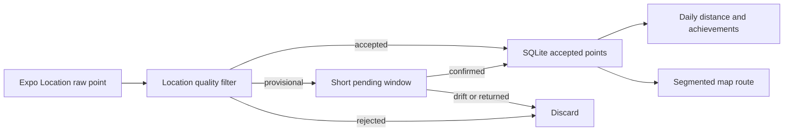

# GPS Track Quality Filter Design

## 目的

Strollia の GPS ログを、受信した位置観測をそのまま保存する方式から、信頼できる移動軌跡を確定保存する方式へ切り替える。

今回の改善で優先するのは以下とする。

- 明らかに不自然な軌跡を全履歴マップへ残さない
- 停止中ドリフトで ODO、TODAY、日別距離を増やさない
- 単発飛び点だけでなく、誤った軌道へ複数点続けて寄ったあと正しい軌道へ戻るケースを和らげる
- 信頼できる短距離移動は残す

短距離移動の取りこぼしはゼロ保証しない。OS が十分な位置観測を届けず、点列として信頼性を確認できない場合は保守的に落とす可能性がある。一方で、空が見える環境などで accuracy が良く自然な点列が得られる短距離移動は、距離の短さだけを理由に捨てない。

## 現状と課題

現在の保存判定は `src/features/location/locationSaveFilter.ts` の `shouldSaveLocationPoint` が担い、新規点と直前保存点から boolean を返す。

現在の構造には以下の課題がある。

1. 候補点の `speed` が存在すると、保存判定用速度として優先される。
2. 大きく飛んだ点は推定速度が上がりやすく、`fast` 保存条件へ入ると距離条件を満たしやすい。
3. 保存を通った点は `location_points` に即保存され、同時に `daily_logs.distance_meters` へ前回保存点との差分距離が加算される。
4. メインマップは保存済み点を Douglas-Peucker で簡略化した単一座標列へ変換し、一本の Polyline として描画する。
5. 速度メーターは `react-native-maps` の `onUserLocationChange` に含まれる speed を直表示し、保存判定用の速度系統と一致していない。

このため、以下の症状が残る。

- 単発で遠方へ飛ぶ点から正しい点へ戻る長い往復線
- 鉄道移動などで近傍の道路側へ複数点寄ったあと、正しい位置へ戻る誤軌道区間
- 停止中ドリフトで移動判定になり、周辺に線と距離が増える問題

## 設計方針

### 信頼性優先

品質判定が弱い点を早く保存するより、確定を遅らせて不自然な軌跡と距離加算を減らす。

### 保存点と観測点を区別する

raw 位置観測は移動ログではない。保存対象は品質判定を通った accepted point とする。

### 判断材料が足りない点は保留する

現行 boolean 判定では保存と破棄しか選べない。新構造では accepted、provisional、rejected を分ける。

### 描画にも保険を置く

保存前フィルタで異常点を抑えても、過去データや境界ケースは残る。描画では異常区間を一本の線でつながない。

## 新しい構造

### 品質判定結果

保存判定は boolean ではなく decision を返す。

```ts
export type LocationQualityDecision =
  | { type: 'accepted'; point: NewLocationPoint }
  | { type: 'provisional'; point: NewLocationPoint; reason: LocationQualityReason }
  | { type: 'rejected'; reason: LocationQualityReason };
```

### コンテキスト

品質判定は直前保存点 1 点だけでなく、最近の確定点と保留点列を参照する。

```ts
export type LocationQualityContext = {
  acceptedPoints: NewLocationPoint[];
  provisionalPoints: NewLocationPoint[];
};
```

初期実装では必要最小限の窓だけを保持する。品質判定層が全履歴を要求しないようにする。

### モジュール境界

現行 `shouldSaveLocationPoint` は新構造で主 API にはしない。

新しい主責務は `LocationQualityFilter` 相当のモジュールが持つ。

- 入力品質判定
- 前回 accepted 点との区間品質判定
- 停止ドリフト判定
- provisional 点列の採否判定
- accepted 点のみ保存へ渡す decision 生成

既存保存条件のうち再利用できるロジックは helper へ分割する。`shouldSaveLocationPoint(point, previousPoint): boolean` を巨大化して provisional 状態まで抱えさせない。

## 判定パイプライン



### 1. 入力品質判定

候補点単体で以下を確認する。

- 緯度経度、timestamp が扱える値か
- accuracy が絶対上限以内か
- 必要に応じて altitudeAccuracy、heading、raw speed の欠損を安全に扱えるか

明白に不正または粗すぎる観測は rejected とする。

### 2. accepted 点との区間評価

直近 accepted 点と候補点から以下を計算する。

- 区間距離
- 経過秒数
- 区間速度
- candidate と previous accepted の accuracy
- 直近 accepted 点列の速度傾向と停止傾向

候補点自身の raw speed は補助情報に下げる。区間速度が高いことを fast 保存の追い風にせず、不自然な jump の疑いとして評価する。

### 3. provisional 点列評価

疑わしい点は即 rejected にせず、短い pending window で保留する。

provisional 区間を accepted へ昇格する条件は以下を組み合わせる。

- 複数点が継続する
- accuracy が十分良い
- 点列内の区間速度が自然
- 進行方向や距離推移が大きく暴れない
- 最後の accepted 点から見た移動として物理的に成立する

provisional 区間を捨てる条件は以下を組み合わせる。

- accepted 軌道から外れたあと、その近傍へ戻る
- 誤軌道区間が往復線や急な横ずれとして現れる
- 点列内の速度・方向・accuracy が不安定
- 停止クラスタ周辺の散りとして説明できる

## 症状別の扱い

### 単発飛び点

短時間に遠方へ飛ぶ候補点は jump suspicion として provisional または rejected にする。

次の観測が直前 accepted 軌道へ戻った場合は飛び点を保存しない。保存前に落ちるため、距離集計とマップ描画に影響しない。

### 複数点続く誤軌道

誤った道路や並走軌道へ数点寄るケースは、点単位で自然に見える場合がある。そのため、新軌道へ即移行せず provisional 区間として扱う。

その区間が十分長く自然に継続すれば新しい accepted 軌道へ昇格する。短時間で元の軌道へ復帰した場合は、誤軌道区間を捨てるか描画区間を切る。

数分以上自然な誤軌道が続き、速度・accuracy・方向も整合する場合は API 観測だけでは真偽判定に限界がある。初期実装は完全除去を目標にせず、誤線の長さと距離への影響を抑える。

### 停止中ドリフト

停止判定は候補点 1 点の速度に依存しない。

直近 accepted 点列が狭い半径に留まり、区間速度中央値が低く、散らばりが accuracy と同程度なら stationary cluster とみなす。

stationary cluster 中は以下を行う。

- クラスタ半径内の散りを保存しない
- 少し外れた点は移動開始ではなく provisional とする
- クラスタ外で高信頼点列が継続した場合のみ移動開始として accepted にする
- 外へ散って戻る点列はドリフトとして rejected にする

## 移動モードと速度帯

ユーザー意図に合わせ、保存品質判定と速度メーターの帯を揃える。

初期設計では以下の速度帯を使う。

- low-speed: `30 km/h` 未満
- vehicle: `30 km/h` 以上 `150 km/h` 未満
- fast: `150 km/h` 以上

現行 `walk` は 30 km/h 未満を表す名前として不適切なため、型名・定数名・テスト説明を見直す。

停止状態は速度帯と別に扱う。停止ドリフト判定は stationary cluster で判断し、低速帯の一部として雑に扱わない。

## 速度算出

### 保存品質判定用速度

主入力は accepted 点列または provisional 点列の区間速度とする。

raw speed は補助情報であり、位置観測が怪しいときにそれだけで保存モードを上げない。

### 速度メーター表示用速度

現行の `react-native-maps` raw speed 直表示を置き換える。

初期改善では以下を狙う。

- 品質判定で採用した点列と整合する速度を使う
- 急激な跳ね上がり・跳ね下がりを平滑化する
- ライブ表示遅延と信頼性のバランスを取る

raw current-location speed を残す場合も、平滑化や妥当性判定の補助入力に限定する。

## 描画設計

保存済み accepted 点を一つの Polyline に渡す設計を改め、RouteSegment を生成する。

segment を切る候補条件は以下とする。

- 長い時間ギャップ
- 区間速度が異常
- 区間距離が不自然
- provisional または rejected 境界
- 品質フィルタの復帰境界

Douglas-Peucker 簡略化は segment ごとに適用する。異常区間を含む全履歴座標列へ先に簡略化をかけて、飛び点を形状点として強く残す流れを避ける。

## データ保存方針

初期実装では accepted 点だけを `location_points` へ保存する。

provisional 点はまず短期 pending window として処理する。バックグラウンドタスクのバッチ境界やアプリ再起動をまたぐ保留の扱いは、実装計画で最小安全範囲を決める。

将来必要なら raw 観測や品質状態の永続化を追加する。

- `quality_status`
- `quality_reason`
- raw observation table
- accepted route point table

ただし初回改善では raw 全保存へ広げず、既存 DB と日別距離更新への影響を抑える。

## 実装スコープ

### 初回改善に含める

1. 新しい品質判定層の導入
2. accepted / provisional / rejected の decision 化
3. 単発 jump guard
4. 停止ドリフトを抑える stationary cluster ベースの最低限判定
5. provisional 点列を使った短期の誤軌道緩和
6. 30 km/h と 150 km/h を使う速度帯変更
7. 速度メーター側の速度帯変更
8. route segment 化による不自然線分の切断
9. docs 更新

### 初回改善に含めない

- 道路・鉄道ネットワークによる map matching
- サーバー側補正
- raw 観測全保存と後処理再構築
- 過去 DB の既存距離を全件自動再計算する移行
- 鉄道専用判定

## テスト方針

AGENTS.md に従い、挙動変更にはテストを追加する。テスト説明は日本語にする。

### 品質判定テスト

- 良精度の短距離移動は accepted になる
- accuracy が絶対上限を超える点は rejected になる
- 単発飛び点は provisional または rejected になり、復帰点で確定保存されない
- 高速に見える jump が fast 保存条件だけで accepted にならない
- 複数 provisional 点が自然に続く場合は accepted へ昇格できる
- 複数 provisional 点のあと accepted 軌道近くへ戻る場合は誤軌道区間を捨てる
- stationary cluster 内ドリフトは距離加算対象にならない
- stationary cluster から高信頼で離脱する短距離移動は採用できる

### 速度テスト

- 30 km/h 境界
- 150 km/h 境界
- raw speed が不自然なとき品質判定が保存を緩めない
- 速度メーター色帯とゲージ帯が新閾値に従う

### 描画テスト

- 異常区間で RouteSegment が分割される
- segment ごとに簡略化される
- 画面が複数 Polyline を描ける

### 距離テスト

- rejected / 未確定 provisional 点が `daily_logs.distance_meters` を増やさない
- accepted 区間のみ距離加算される

## リスクと制約

- OS が自然に見える誤軌道を長時間返す場合、アプリ側だけで真値を確定できない。
- 保留を強めるほどライブ保存や速度表示に遅延が出る。
- バックグラウンドタスクの batch 境界をまたぐ provisional 管理は単純な純粋関数より難しい。
- 過去に保存済みの外れ点は保存フィルタだけでは消えないため、描画 segment 化が重要になる。

## 完了条件

- 新規取得時に単発飛び点が距離とルートへ入りにくくなる
- 停止中ドリフトが距離と軌跡へ入りにくくなる
- 短い誤軌道区間が provisional と復帰判定で和らぐ
- 速度分類と速度メーターが 30 km/h、150 km/h 閾値へ揃う
- 既存/境界データでも不自然区間を一本線でつなぎにくくなる
- 型チェックと全テストが通る
