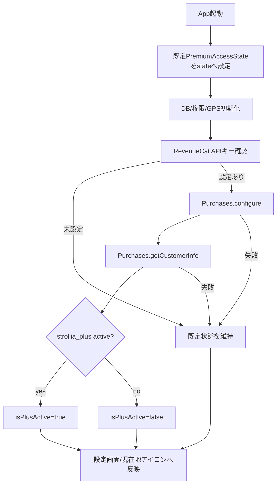

# RevenueCat SDK導入設計

## 1. 目的

Strollia Plusの課金状態をRevenueCatから取得できる基盤を追加する。

今回の対象は、RevenueCat SDKの導入、SDK初期化、`CustomerInfo` による `strollia_plus` entitlement判定までとする。購入、復元、Paywall、商品一覧表示は次のPRで扱う。

## 2. 背景

現在は `src/features/premium/` にRevenueCat連携を見越した境界があり、`getDefaultPremiumAccessState()` が開発用フラグ `EXPO_PUBLIC_ENABLE_PREMIUM_ACCESS_WITHOUT_REVENUECAT` を見てPlus状態を返している。

設定画面や現在地アイコンのロック判定はすでに `PremiumAccessState` を参照しているため、UIへRevenueCat SDKを直接結合せず、既存のpremium境界の内側だけを差し替える。

RevenueCat公式のExpo向け手順では、`react-native-purchases` を導入し、実購入や実SDK動作の確認にはExpo development buildが必要である。Expo GoではPreview API Modeによりロジック確認はできるが、実購入テストは対象外とする。

## 3. 対象範囲

### 3.1 対象

- `react-native-purchases` を依存関係に追加する
- iOS/AndroidのRevenueCat APIキーを環境変数から読み込む
- APIキーがあるプラットフォームだけRevenueCat SDKを初期化する
- `Purchases.getCustomerInfo()` の `entitlements.active.strollia_plus` からPlus有効状態を解決する
- SDK未設定、未対応プラットフォーム、取得失敗時は既存の既定状態へフォールバックする
- `App.tsx` で起動後に課金状態を非同期取得し、設定画面と現在地アイコン反映へ渡す
- 仕様書とTodoを更新する

### 3.2 対象外

- 購入フロー
- 復元フロー
- Paywall表示
- `react-native-purchases-ui` の導入
- RevenueCat Offering / Package / Productの表示
- 匿名ID以外のログインID連携
- App Store Connect / Google Play Console / RevenueCat Dashboardの実設定

## 4. 環境変数

以下の環境変数を使う。

- `EXPO_PUBLIC_REVENUECAT_IOS_API_KEY`
- `EXPO_PUBLIC_REVENUECAT_ANDROID_API_KEY`

値が未設定の場合、そのプラットフォームではRevenueCat SDKを初期化しない。未設定時もアプリ起動やGPS記録は止めず、既存の `getDefaultPremiumAccessState()` にフォールバックする。

開発用フラグ `EXPO_PUBLIC_ENABLE_PREMIUM_ACCESS_WITHOUT_REVENUECAT` は残す。RevenueCat APIキー未設定時やSDK取得失敗時に、Plus機能の見た目確認を続けられるようにするためである。

## 5. アーキテクチャ

### 5.1 premium境界

`src/features/premium/` にRevenueCat SDKを薄く包む実装を追加する。

想定する責務は以下である。

- 現在プラットフォームのRevenueCat APIキーを解決する
- SDKを一度だけ初期化する
- `CustomerInfo` から `strollia_plus` entitlementの有効状態を判定する
- エラー時にUI層へSDK例外を漏らさず、既定状態へ倒す

UIはRevenueCat SDKの型や関数を直接参照しない。`App.tsx` は `PremiumAccessState` だけを扱う。

### 5.2 App.tsx連携

現在の `premiumAccessState` は `useMemo(() => getDefaultPremiumAccessState(), [])` で同期的に固定されている。

これを `useState(getDefaultPremiumAccessState())` に変更し、アプリ初期化後にRevenueCat由来の状態を非同期で取得して `setPremiumAccessState` する。

課金状態取得に失敗しても、以下の動作は止めない。

- DB初期化
- 位置情報権限確認
- GPS自動記録
- GPXインポート/エクスポート
- 実績評価
- 設定画面表示

失敗時は必要に応じて `console.warn` に留め、ユーザー向けAlertは出さない。購入導線がまだない段階では、課金状態取得失敗をユーザーに中断エラーとして見せる価値が低いためである。

## 6. データフロー

## 7. エラーハンドリング

- APIキー未設定: SDKを初期化せず既定状態を返す
- 未対応プラットフォーム: SDKを初期化せず既定状態を返す
- `Purchases.configure` 失敗: warningを出し既定状態を返す
- `Purchases.getCustomerInfo` 失敗: warningを出し既定状態を返す
- entitlement未付与: `isPlusActive=false`

RevenueCatへGPSログ、写真メタデータ、移動履歴は送信しない。

## 8. テスト方針

### 8.1 Unit Test

`src/features/premium/` に以下を追加または更新する。

- iOS APIキーがある場合にSDK初期化設定を作る
- Android APIキーがある場合にSDK初期化設定を作る
- APIキー未設定時はRevenueCat未設定として扱う
- `CustomerInfo.entitlements.active.strollia_plus` がある場合にPlus有効
- entitlementがない場合にPlus無効
- SDK取得失敗時は既定状態へフォールバック

### 8.2 App連携テスト

既存の `AppMapReturn.test.tsx` はpremium境界をmockしているため、必要最小限のmock更新に留める。RevenueCat SDK自体をAppテストへ漏らさない。

### 8.3 検証コマンド

- `npm run typecheck`
- `npm test -- --runInBand`

実購入確認は今回のPRでは行わない。RevenueCat公式手順上、実購入確認にはdevelopment buildとストア/RevenueCat Dashboard設定が必要なため、次PR以降の購入・復元フローで扱う。

## 9. ドキュメント更新

以下を更新する。

- `docs/monetization.md`
  - RevenueCat SDK導入後の状態取得方針
  - APIキー環境変数
  - development buildが必要なこと
  - 購入・復元は次段階であること
- `docs/todo.md`
  - `RevenueCat SDKを導入する` を完了にする
  - `CustomerInfoでPlus有効状態を判定する` を完了にする
  - `購入・復元フローを実装する` は未完了のまま残す

## 10. 実装順序

1. RevenueCat SDK依存を追加する
2. premium境界のテストを先に追加する
3. SDK初期化とCustomerInfo判定の薄いクライアントを実装する
4. `App.tsx` のpremium状態を非同期更新へ差し替える
5. 設定画面の文言を「準備中」からSDK連携済みに合わせて調整する
6. ドキュメントとTodoを更新する
7. typecheckと全テストを実行する

## 11. リスク

- `react-native-purchases` はネイティブモジュールを含むため、実機での完全確認にはdevelopment buildが必要になる
- APIキー未設定環境でSDK初期化を試みると起動時エラーにつながる可能性があるため、必ず未設定ガードを置く
- `CustomerInfo` の型はSDKバージョンに依存するため、実装時は導入されたSDKの型定義に合わせる
- 購入・復元UIを同時に入れると、RevenueCat Dashboardやストア商品設定の影響範囲が広がるため、今回は分離する

